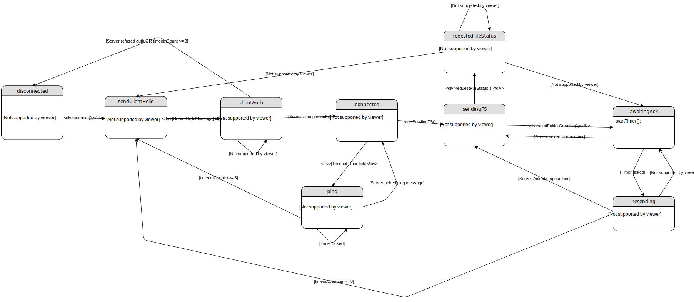

# protocol-assignment-1

### ToDo:
* Send file metadata e.g. rights, owner, creation date, ...

### Important:
* UDP MTU
* Don't create packages with a size of (bit-size mod 8) != 0. It makes it hard on the receiver side to interpret those!

## Protocol:

### General field descriptions:
Type [4 Bit]:<br/>
	0000 => Client-Hello-Handshake<br/>
	0001 => Server-Hello-Handshake<br/>
	0010 => File-Creation<br/>
	0011 => File-Transfer<br/>
	0100 => File-Status<br/>
	0101 => ACK<br/>
	0110 => Ping<br/>
	0111 => Transfer-Ended<br/>
	1000 => Auth-Request<br/>
	1001 => Auth-Result<br/>

Client ID [32 Bit]:<br/>
	An unique client id generated by the client on first contact.<br/>
	E.g. A random int

Checksum [32 Bit]:<br/>
	CRC32 Algorithm [Wiki Link](https://en.wikipedia.org/wiki/Cyclic_redundancy_check)

Sequence Number [32 bit]:<br/>
	Like TCP.
	
FID Length [64 Bit]:<br/>
	The length of the ```FID``` field in bytes.

FID [Defined in the ```FID Length``` filed]:
	The relative path to the file. Includes the file name e.g. ```folder/file.txt```.

FID Part Number [32 Bit]:<br/>
	The file part number.

Pub Key [32 Bit]:<br/>
	The client public key for the Diffie Hellman encryption.

### Client-Hello-Handshake:
The initial connection message that gets send by the client.
```
0      4       8      24          56             88              120        152
+------+-------+------+-----------+--------------+----------------+---------+
| Type | Flags | Port | Client ID | Prime Number | Primitive Root | Pub Key |
+------+-------+------+-----------+--------------+----------------+---------+
152        184               216                 1000
+----------+-----------------+----------+--------+
| Checksum | Username Length | Username | UNUSED |
+----------+-----------------+----------+--------+
```

Flags [4 Bit]:
```
0000
||||
|||+-> Connect requested
||+--> Reconnect
|+---> *UNUSED*
+----> *UNUSED*
```

Port [16 Bit]:<br/>
	The port on which the client listens to server messages.

Prime Number [32 Bit]:<br/>
	The client prime number for the Diffie Hellman encryption.
	
Primitive Root [32 Bit]:<br/>
	The client primitive root for the Diffie Hellman encryption.

Username Length [32 Bit]:<br/>
	Describes how long the the following Username is in byte.

Username [X Byte]:<br/>
	Defined via the ```Username Length```.

UNUSED [816-X Bit]:<br/>
	To "prevent" DoS attacks. Ensures the package is a least 1000 Bit long.

### Server-Hello-Handshake:
Once the server received a ```Client-Hello-Handshake``` message he should reply with this message.
```
0      4       8           40                56            88        120        152
+------+-------+-----------+-----------------+-------------+---------+----------+
| Type | Flags | Client ID | Sequence Number | Upload-port | Pub Key | Checksum |
+------+-------+-----------+-----------------+-------------+---------+----------+
```

Upload-port [16 Bit]:<br/>
	The Port where the client should send all following messages to.

Flags [4 Bit]:
```
0000
||||
|||+-> Client accepted
||+--> Too many clients - connection revoked
|+---> Client ID taken - connection revoked
+----> Invalid username - connection revoked
```

### File-Creation:
Marks the start of a file transfer. Tells the server to create the given file with the given path.
Replaces existing files.
```
0      4           36                68          72              328        360          424
+------+-----------+-----------------+-----------+----------+----------+------------+-----+
| Type | Client ID | Sequence Number | File Type | File MD5 | Checksum | FID Length | FID |
+------+-----------+-----------------+-----------+----------+----------+------------+-----+

```

File Type [4 Bit]:<br/>
```
0000
||||
|||+-> Folder
||+--> Delete folder
|+---> File
+----> Delete file
```

File MD5 hash [256 Bit]:<br/>
	The file MD5 hash to check if the file was transmitted correctly. Unused for folders. [Wiki Link](https://en.wikipedia.org/wiki/MD5)


### File-Transfer:
The actual file transfer message containing the file content.
```
0      4           36                68      72                104
+------+-----------+-----------------+-------+-----------------+
| Type | Client ID | Sequence Number | Flags | FID Part Number |
+------+-----------+-----------------+-------+-----------------+

104            360        392              456
+--------------+----------+----------------+---------+
| FID SHA3 256 | Checksum | Content Length | Content |
+--------------+----------+----------------+---------+
```

Flags [4 Bit]:
```
0000
||||
|||+-> First package for the given file
||+--> File content
|+---> *UNUSED*
+----> Last package for the file
```

FID SHA3 256 [256 Bit]:<br/>
	The SHA3 256 hash of the ```FID``` to identify which file gets.

Content Length [max 900 Bit]:<br/>
	The length of the ```Content``` field.

Content [defined in "Content Length" in Bit]:<br/>
	The actual file content.

### File-Status:
Used for requesting and responding the current file status bevor a file gets transfered.
```
0      4       8           40                72                     104
+------+-------+-----------+-----------------+----------------------+
| Type | Flags | Client ID | Sequence Number | Last FID Part Number |
+------+-------+-----------+-----------------+----------------------+

104        136          200
+----------+------------+-----+
| Checksum | FID Length | FID |
+----------+------------+-----+
```

Flags [4 Bit]:
```
0000
||||
|||+-> Request status of FID
||+--> FID status response
|+---> Restart sending file system
+----> File = 0/Folder = 1
```

Last FID Part Number [32 Bit]:
	The last received ```FID Part Number```. Ignored if ```Request status of FID``` is set.


### ACK:
For acknowledging ```Ping```, ```File-Creation``` and ```File-Transfer``` messages.
```
0      4                     36         68      72
+------+---------------------+----------+--------+
| Type | ACK Sequence Number | Checksum | UNUSED |
+------+---------------------+----------+--------+
```

ACK Sequence Number [32 Bit]:<br/>
	The acknowledged ```Sequence Number``` or ```Ping Sequence Number```.

### Transfer-Ended:
Gets send by the client once he wants to end the transfer/close the connection.
```
0      4       8           40         72
+------+-------+-----------+----------+
| Type | Flags | Client ID | Checksum |
+------+-------+-----------+----------+
```

Flags [4 Bit]:
```
0000
||||
|||+-> Transfer finished
||+--> Cancelled by user
|+---> Error
+----> *UNUSED*
```

### Ping:
This message is used for ensuring the opponent is still there. The opponent should acknowledge each received ```Ping``` message with an ```Server-ACK```.Should get send by each side if there was no message exchange for more than 2 seconds.<br/>
It also can be used for package loss and throughput tests with a modified ```Payload Length```.
```
0      4                      36         68          100      104              136
+------+----------------------+-----------+----------+--------+----------------+---------+
| Type | Ping Sequence Number | Client ID | Checksum | Unused | Payload Length | Payload |
+------+----------------------+-----------+----------+--------+----------------+---------+
```

Ping Sequence Number [32 Bit]<br/>
	An unique number for identifying each ping.

Payload Length [32 Bit]:<br/>
	Describes how long the the following payload is in byte.

Payload [X Byte]:<br/>
	Defined via the ```Payload Length```.

### Auth-Request:
Send by the client to authentificate at the server.
```
0      4        8           40         72                104
+------+--------+-----------+----------+-----------------+----------+
| Type | UNUSED | Client ID | Checksum | Password Length | Password |
+------+--------+-----------+----------+-----------------+----------+
```

Password Length [32 Bit]:<br/>
	Describes how long the the following password is in byte.

Password [X Byte]:<br/>
	Defined via the ```Password Length```.

### Auth-Result:
Send by the server with the authentification result.
```
0      4       8           40         72
+------+-------+-----------+----------+
| Type | Flags | Client ID | Checksum |
+------+-------+-----------+----------+
```

Flags [4 Bit]:
```
0000
||||
|||+-> Authentification successfull
||+--> *UNUSED*
|+---> *UNUSED*
+----> *UNUSED*
```

## State charts:
### FileClient:


### FileServer:
The server it selfe is stateless but it has ```FileServerClient``` objects with the following state chart:


## Process example:

```
      Client				  Server
	|	Client-Hello-Handshake	    |
	| --------------------------------> | The clients starts the connection on the default port
	|				    | and tells the server the port on which he listens for answers
	|	Server-Hello-Handshake      |
	| <-------------------------------- | The server responds with a client ID and a port where the
	|				    | server is listening for incoming transfer messages
	|	File-Creation		    |
	| --------------------------------> | The client sends this message to inform the server about
	|				    | the new file that will be transferred
	|	Server-ACK  		    |
	| <-------------------------------- |
	|				    |
	|	File-Transfer		    |
	| --------------------------------> | The client starts sending the file
	|				    |
	|	File-Transfer		    |
	| --------------------------------> |
	|				    |
	|	File-Transfer		    |
	| --------------------------------> |
	|				    |
	|	File-Transfer		    |
	| --------------------------------> |
	|				    |
	|	Server-ACK  		    |
	| <-------------------------------- | The server sends an ACK message for each message
	|				    | it received from the client
	|	Server-ACK  		    |
	| <-------------------------------- |
	|				    |
	|	Server-ACK  		    |
	| <-------------------------------- |
	|				    |
	|	Transfer-Ended		    |
	| --------------------------------> | The client tells the server that the transfer finished
```

## Key Exhange

```
      Client				  Server
	|	ClientStartConnection	    |
	| --------------------------------> | Client calculates and sends P,G, it's public key
	|				    | 
	|	onServerReceive             |
	| <-------------------------------- | Server calculates it's shared key,public key and sends it's public key to client
	|				    | sets secureConnection to true
	|	onClientReceive		    |
	| --------------------------------> | Client calculates it's shared key
	|                                   | sets secure connection to true

```
