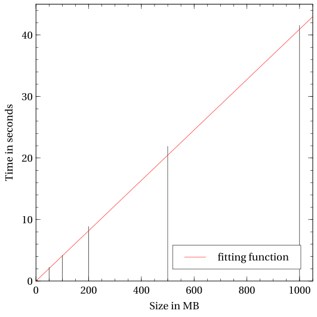
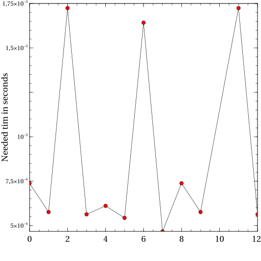
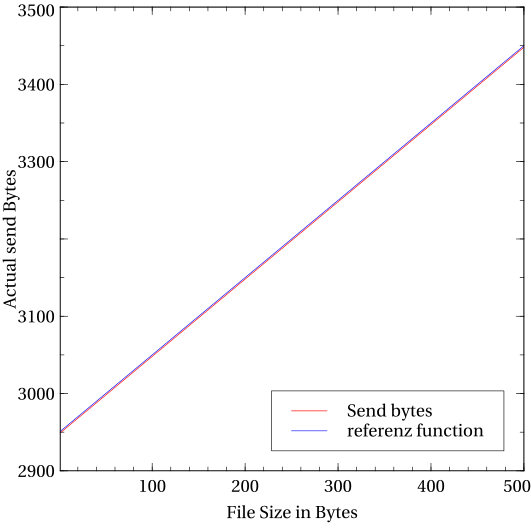

## Benchmark
### Time for fixed size of packages
To find out how quick we can transfer files we edited the Server component to measure time from the `File-Creation` message to the last file part. We collected the time needed for several test files (5 MB, 50 MB, 100 MB, 200 MB, 1000MB). The client and server were executed on the same machine (i7 7500u, 16GB RAM, SSD) and the packages got send trough the Loopback interface.

In this graph you can see that with the margin of error the time needed to transfer files grows `linearly` with file size. The achieved speed was overall `24.64 MB/s`.

### Time to first Byte
For the next figure, we modified the server, to measure the time from the creation of the `FilesystemServer` object to the first message it received. This test has been run multiple times. 
All results are between `0.00467s` and `0.001724s`. This is a huge span. But we think that this is through differences in the scheduling of the machine running the benchmark. 

### Send byte size per package
To compare the send bytes with the file size, we created a simple function. `f(x, a, z) := (2 a + 1200 ⌊x/100⌋ + 10 x + z + 2960)`.
It's parameters are:
* x := The actual length of the file send
* a := The length of the FID (path + filename)
* z := The length of the password
To visualize it we fixed a and z (a = 40, z = 8).

We also added a linear reference function to the plot. In this graph you can see that the send bytes grow linear with the file size.
